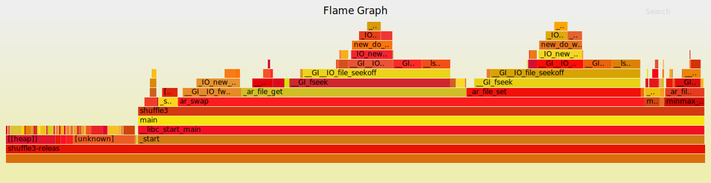
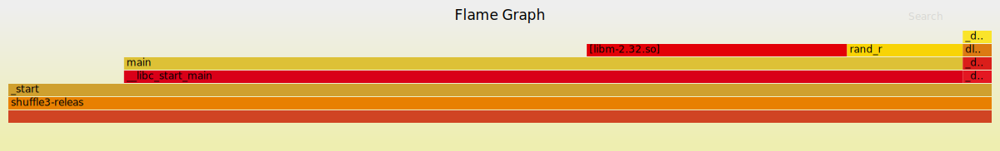
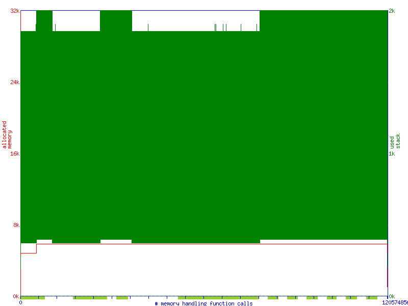
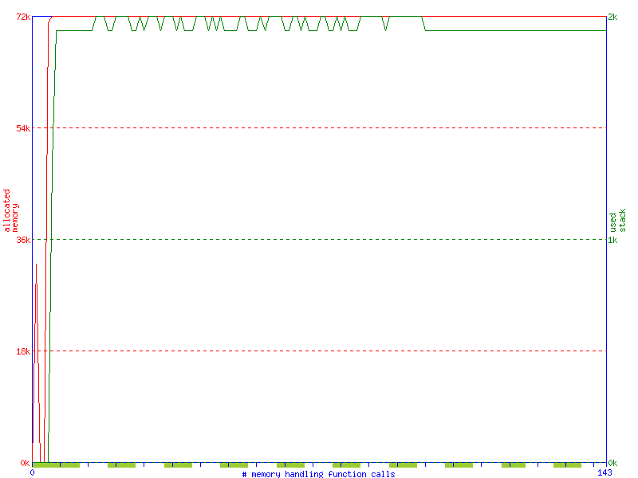

# `shuffle3-lean` - Improved 3 stage byte shuffler

Deterministically and reversably shuffle a file's bytes around.

## Shuffling
Shuffle a file in place

``` shell
$ shuffle3 -s file
```

## Unshuffling
Unshuffle a file in place

``` shell
$ shuffle3 -u file
```

## Other options
Run with `-h` for more options.

# Improvements from `v1`
* **~70-80x** speedup from shuffle3 v1.0
* Huge reduction in syscalls
* Takes advantage of the kernel's fs cache
* Can properly handle large files without core dumping
* Doesn't dump huge amounts of trash onto each stack frame

## Performance
[https://github.com/sharkdp/hyperfine](hyperfine) reports a **700-800%** speedup over `v1`.
It's easy to see why.

### V1 flamegraph
V1 uses a pesudo-array adaptor to perform filesystem reads, seeks, and writes. This causes a massive syscall overhead.


### V2 flamegraph
Whereas V2 uses a single `mmap()`.


## Memory usage
The [https://www.systutorials.com/docs/linux/man/1-memusage/](memusage) graph for =v1= shows extremely inefficient stack usage.

( the green is supposed to be a line, not a bar )
This is due to how the unshuffler buffers RNG results.

`v1` naively used VLAs to store this buffer, which can baloon to 8 times the size of the file being unshuffled.
It dumps this massive buffer onto the stack frame of a function that is called multiple times, causing massive and inefficient stack usage.

This can cause a segfault when attempting to unshuffle a large file, while shuffling a file of the same size might succeed.

### V2 improvement
The `memusage` graph for `v2` is a lot more sane.


`v2` instead allocates this buffer on the heap. Note the stable stack and heap usage.


# Building
Run `make` to build the normal binary. It will output to `shuffle3-release`.

## Release target
The `release` (default) target uses the variables `RELEASE_CFLAGS`, `RELEASE_CXXFLAGS` and `RELEASE_LDFLAGS` to specify opitimisations, as well as the `OPT_FLAGS` variable. These can be set by you if you wish.

### Note
The default `OPT_FLAGS` contains the flag `-march=native`. This may be underisable for you, in which case set the variable or modify the makefile to remove it.

## Debug target
To build with debug information, run `make debug`. Extra debug flags can be provided with the `DEBUG_CFLAGS`, `DEBUG_CXXFLAGS` and `DEBUG_LDFLAGS` variables which have default values in the Makefile.

The build and unstripped binary will be `shuffle3-debug`.

## Notes
Before switching between `release` and `debug` targets, remember to run `make clean`.
To disable stripping of release build binaries, run with `make STRIP=: release`

# License
GPL'd with <3
